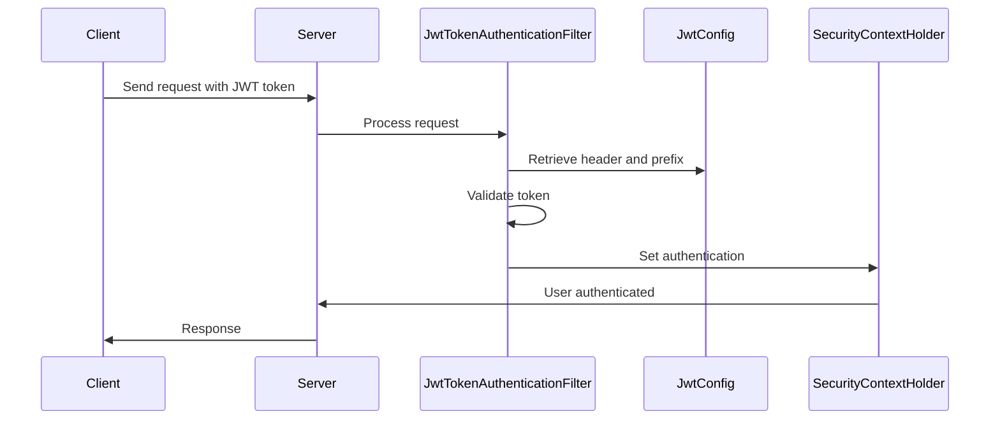

# Introduction

This document will walk you through the authentication service implemented in the Instagram clone project. The service is designed to ensure secure access to resources by validating JWT tokens.

We will cover:

1. How the JWT token authentication filter is structured and why it is used.
2. The flow of authentication within the filter.
3. A visual representation of the authentication process.
4. Key takeaways from the implementation.

# Authentication flow

## Jwt token authentication filter

<SwmSnippet path="/ec-export-service/src/main/java/com/clone/instagram/instafeedservice/config/JwtTokenAuthenticationFilter.java" line="19">

---

The <SwmToken path="/ec-export-service/src/main/java/com/clone/instagram/instafeedservice/config/JwtTokenAuthenticationFilter.java" pos="19:4:4" line-data="public class JwtTokenAuthenticationFilter extends OncePerRequestFilter {">`JwtTokenAuthenticationFilter`</SwmToken> is a custom filter that extends <SwmToken path="/ec-export-service/src/main/java/com/clone/instagram/instafeedservice/config/JwtTokenAuthenticationFilter.java" pos="19:8:8" line-data="public class JwtTokenAuthenticationFilter extends OncePerRequestFilter {">`OncePerRequestFilter`</SwmToken>. This ensures that the filter is executed once per request, which is crucial for validating JWT tokens consistently.

```
public class JwtTokenAuthenticationFilter extends OncePerRequestFilter {

    private final JwtConfig jwtConfig;

    public JwtTokenAuthenticationFilter(JwtConfig jwtConfig) {
        this.jwtConfig = jwtConfig;
    }
```

---

</SwmSnippet>

<SwmSnippet path="/ec-export-service/src/main/java/com/clone/instagram/instafeedservice/config/JwtTokenAuthenticationFilter.java" line="27">

---

The <SwmToken path="/ec-export-service/src/main/java/com/clone/instagram/instafeedservice/config/JwtTokenAuthenticationFilter.java" pos="28:5:5" line-data="    protected void doFilterInternal(HttpServletRequest request, HttpServletResponse response, FilterChain chain)">`doFilterInternal`</SwmToken> method is overridden to implement the core logic of token validation. This method processes incoming requests and checks for the presence of a valid JWT token.

```
    @Override
    protected void doFilterInternal(HttpServletRequest request, HttpServletResponse response, FilterChain chain)
            throws ServletException, IOException {
```

---

</SwmSnippet>

<SwmSnippet path="/ec-export-service/src/main/java/com/clone/instagram/instafeedservice/config/JwtTokenAuthenticationFilter.java" line="31">

---

The filter first retrieves the authentication header from the request. It checks if the header is present and if it starts with the expected prefix. If the header is invalid, the request proceeds to the next filter without authentication.

```
        // 1. get the authentication header. Tokens are supposed to be passed in the authentication header
        String header = request.getHeader(jwtConfig.getHeader());

        // 2. validate the header and check the prefix
        if(header == null || !header.startsWith(jwtConfig.getPrefix())) {
            chain.doFilter(request, response);  		// If not valid, go to the next filter.
            return;
        }
```

---

</SwmSnippet>

<SwmSnippet path="/ec-export-service/src/main/java/com/clone/instagram/instafeedservice/config/JwtTokenAuthenticationFilter.java" line="40">

---

If the token is absent, the user is not authenticated, which is acceptable for public paths or token requests. Secured paths require a valid token, and access without one results in an exception.

```
        // If there is no token provided and hence the user won't be authenticated.
        // It's Ok. Maybe the user accessing a public path or asking for a token.

        // All secured paths that needs a token are already defined and secured in config class.
        // And If user tried to access without access token, then he won't be authenticated and an exception will be thrown.
```

---

</SwmSnippet>

<SwmSnippet path="/ec-export-service/src/main/java/com/clone/instagram/instafeedservice/config/JwtTokenAuthenticationFilter.java" line="51">

---

Once the token is extracted from the header, it is validated using the secret key defined in the <SwmToken path="/ec-export-service/src/main/java/com/clone/instagram/instafeedservice/config/JwtTokenAuthenticationFilter.java" pos="21:5:5" line-data="    private final JwtConfig jwtConfig;">`JwtConfig`</SwmToken>. This step is crucial to ensure the token's integrity and authenticity.

```
            // 4. Validate the token
            Claims claims = Jwts.parser()
                    .setSigningKey(jwtConfig.getSecret().getBytes())
                    .parseClaimsJws(token)
                    .getBody();
```

---

</SwmSnippet>

<SwmSnippet path="/ec-export-service/src/main/java/com/clone/instagram/instafeedservice/config/JwtTokenAuthenticationFilter.java" line="57">

---

The claims from the token are parsed to retrieve the username and authorities. These claims are essential for constructing the authentication object.

```
            String username = claims.getSubject();
            if(username != null) {
                List<String> authorities = (List<String>) claims.get("authorities");
```

---

</SwmSnippet>

<SwmSnippet path="/ec-export-service/src/main/java/com/clone/instagram/instafeedservice/config/JwtTokenAuthenticationFilter.java" line="61">

---

An <SwmToken path="/ec-export-service/src/main/java/com/clone/instagram/instafeedservice/config/JwtTokenAuthenticationFilter.java" pos="62:3:3" line-data="                // UsernamePasswordAuthenticationToken: A built-in object, used by spring to represent the current authenticated / being authenticated user.">`UsernamePasswordAuthenticationToken`</SwmToken> is created using the username and authorities. This object represents the authenticated user and is set in the security context.

```
                // 5. Create auth object
                // UsernamePasswordAuthenticationToken: A built-in object, used by spring to represent the current authenticated / being authenticated user.
                // It needs a list of authorities, which has type of GrantedAuthority interface, where SimpleGrantedAuthority is an implementation of that interface
                UsernamePasswordAuthenticationToken auth =
                        new UsernamePasswordAuthenticationToken(username, null,
                                authorities
                                        .stream()
                                        .map(SimpleGrantedAuthority::new)
                                        .collect(toList()));
```

---

</SwmSnippet>

<SwmSnippet path="/ec-export-service/src/main/java/com/clone/instagram/instafeedservice/config/JwtTokenAuthenticationFilter.java" line="71">

---

Finally, the user is authenticated by setting the authentication object in the <SwmToken path="/ec-export-service/src/main/java/com/clone/instagram/instafeedservice/config/JwtTokenAuthenticationFilter.java" pos="73:1:1" line-data="                SecurityContextHolder.getContext().setAuthentication(auth);">`SecurityContextHolder`</SwmToken>. This step completes the authentication process for the request.

```
                // 6. Authenticate the user
                // Now, user is authenticated
                SecurityContextHolder.getContext().setAuthentication(auth);
            }
```

---

</SwmSnippet>

<SwmSnippet path="/ec-export-service/src/main/java/com/clone/instagram/instafeedservice/config/JwtTokenAuthenticationFilter.java" line="76">

---

In case of any exceptions during token parsing, the security context is cleared to prevent unauthorized access.

```
        } catch (Exception e) {
            // In case of failure. Make sure it's clear; so guarantee user won't be authenticated
            SecurityContextHolder.clearContext();
        }
```

---

</SwmSnippet>

<SwmSnippet path="/ec-export-service/src/main/java/com/clone/instagram/instafeedservice/config/JwtTokenAuthenticationFilter.java" line="81">

---

The filter chain continues after processing the request, allowing subsequent filters to execute.

```
        // go to the next filter in the filter chain
        chain.doFilter(request, response);
    }
}
```

---

</SwmSnippet>

## Jwt configuration

<SwmSnippet path="/ec-export-service/src/main/java/com/clone/instagram/instafeedservice/config/JwtConfig.java" line="9">

---

The <SwmToken path="/ec-export-service/src/main/java/com/clone/instagram/instafeedservice/config/JwtTokenAuthenticationFilter.java" pos="21:5:5" line-data="    private final JwtConfig jwtConfig;">`JwtConfig`</SwmToken> class holds the configuration properties for JWT tokens, such as the URI, header, prefix, expiration, and secret. These properties are injected from the application's configuration files.

```
@Data
@NoArgsConstructor
@Component
public class JwtConfig {

    @Value("${security.jwt.uri:/auth/**}")
    private String Uri;
```

---

</SwmSnippet>

# Mermaid diagram

Below is a visual representation of the authentication flow using a mermaid diagram:



# Conclusion

The authentication service is designed to validate JWT tokens efficiently, ensuring secure access to resources. The <SwmToken path="/ec-export-service/src/main/java/com/clone/instagram/instafeedservice/config/JwtTokenAuthenticationFilter.java" pos="19:4:4" line-data="public class JwtTokenAuthenticationFilter extends OncePerRequestFilter {">`JwtTokenAuthenticationFilter`</SwmToken> plays a pivotal role in processing requests and authenticating users based on token validity. This implementation provides a robust mechanism for securing endpoints and managing user sessions in a stateless manner.

<SwmMeta version="3.0.0" repo-id="Z2l0aHViJTNBJTNBZWFzeUNvbmZpZyUzQSUzQUFzYXJ1ZGhlZW5L" repo-name="easyConfig"><sup>Powered by [Swimm](https://app.swimm.io/)</sup></SwmMeta>
