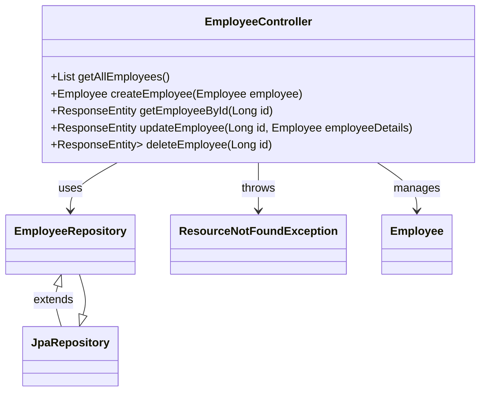

# Introduction



This document will walk you through the implementation of the <SwmToken path="/springboot-backend/src/main/java/net/javaguides/springboot/controller/EmployeeController.java" pos="26:4:4" line-data="public class EmployeeController {">`EmployeeController`</SwmToken> class in a Spring Boot application. The purpose of this class is to manage CRUD operations for employee entities via RESTful APIs.

We will cover:

1. Why the <SwmToken path="/springboot-backend/src/main/java/net/javaguides/springboot/controller/EmployeeController.java" pos="26:4:4" line-data="public class EmployeeController {">`EmployeeController`</SwmToken> class is structured with specific REST endpoints.
2. How the <SwmToken path="/springboot-backend/src/main/java/net/javaguides/springboot/controller/EmployeeController.java" pos="21:10:10" line-data="import net.javaguides.springboot.repository.EmployeeRepository;">`EmployeeRepository`</SwmToken> interface is utilized for database operations.
3. The rationale behind exception handling in the controller.

# <SwmToken path="/springboot-backend/src/main/java/net/javaguides/springboot/controller/EmployeeController.java" pos="26:4:4" line-data="public class EmployeeController {">`EmployeeController`</SwmToken> structure

<SwmSnippet path="/springboot-backend/src/main/java/net/javaguides/springboot/controller/EmployeeController.java" line="19">

---

The <SwmToken path="/springboot-backend/src/main/java/net/javaguides/springboot/controller/EmployeeController.java" pos="26:4:4" line-data="public class EmployeeController {">`EmployeeController`</SwmToken> class is annotated with <SwmToken path="/springboot-backend/src/main/java/net/javaguides/springboot/controller/EmployeeController.java" pos="24:0:1" line-data="@RestController">`@RestController`</SwmToken> and <SwmToken path="/springboot-backend/src/main/java/net/javaguides/springboot/controller/EmployeeController.java" pos="25:0:1" line-data="@RequestMapping(&quot;/api/v1/&quot;)">`@RequestMapping`</SwmToken> to define it as a RESTful web service controller. The <SwmToken path="/springboot-backend/src/main/java/net/javaguides/springboot/controller/EmployeeController.java" pos="23:0:1" line-data="@CrossOrigin(origins = &quot;http://localhost:4200&quot;)">`@CrossOrigin`</SwmToken> annotation allows cross-origin requests from the specified URL.

```
import net.javaguides.springboot.exception.ResourceNotFoundException;
import net.javaguides.springboot.model.Employee;
import net.javaguides.springboot.repository.EmployeeRepository;

@CrossOrigin(origins = "http://localhost:4200")
@RestController
@RequestMapping("/api/v1/")
public class EmployeeController {
```

---

</SwmSnippet>

# Retrieving all employees

<SwmSnippet path="/springboot-backend/src/main/java/net/javaguides/springboot/controller/EmployeeController.java" line="28">

---

The <SwmToken path="/springboot-backend/src/main/java/net/javaguides/springboot/controller/EmployeeController.java" pos="33:8:8" line-data="	public List&lt;Employee&gt; getAllEmployees(){">`getAllEmployees`</SwmToken> method is mapped to the <SwmToken path="/springboot-backend/src/main/java/net/javaguides/springboot/controller/EmployeeController.java" pos="32:5:6" line-data="	@GetMapping(&quot;/employees&quot;)">`/employees`</SwmToken> endpoint using <SwmToken path="/springboot-backend/src/main/java/net/javaguides/springboot/controller/EmployeeController.java" pos="32:1:2" line-data="	@GetMapping(&quot;/employees&quot;)">`@GetMapping`</SwmToken>. It retrieves all employee records from the database by calling <SwmToken path="/springboot-backend/src/main/java/net/javaguides/springboot/controller/EmployeeController.java" pos="34:5:7" line-data="		return employeeRepository.findAll();">`findAll()`</SwmToken> on the <SwmToken path="/springboot-backend/src/main/java/net/javaguides/springboot/controller/EmployeeController.java" pos="29:5:5" line-data="	private EmployeeRepository employeeRepository;">`employeeRepository`</SwmToken>.

```
	@Autowired
	private EmployeeRepository employeeRepository;
	
	// get all employees
	@GetMapping("/employees")
	public List<Employee> getAllEmployees(){
		return employeeRepository.findAll();
	}		
```

---

</SwmSnippet>

# Creating and retrieving an employee

<SwmSnippet path="/springboot-backend/src/main/java/net/javaguides/springboot/controller/EmployeeController.java" line="37">

---

The <SwmToken path="/springboot-backend/src/main/java/net/javaguides/springboot/controller/EmployeeController.java" pos="39:5:5" line-data="	public Employee createEmployee(@RequestBody Employee employee) {">`createEmployee`</SwmToken> method handles POST requests to <SwmToken path="/springboot-backend/src/main/java/net/javaguides/springboot/controller/EmployeeController.java" pos="38:5:6" line-data="	@PostMapping(&quot;/employees&quot;)">`/employees`</SwmToken>, creating a new employee record in the database. The <SwmToken path="/springboot-backend/src/main/java/net/javaguides/springboot/controller/EmployeeController.java" pos="45:8:8" line-data="	public ResponseEntity&lt;Employee&gt; getEmployeeById(@PathVariable Long id) {">`getEmployeeById`</SwmToken> method retrieves an employee by ID, throwing a <SwmToken path="/springboot-backend/src/main/java/net/javaguides/springboot/controller/EmployeeController.java" pos="47:11:11" line-data="				.orElseThrow(() -&gt; new ResourceNotFoundException(&quot;Employee not exist with id :&quot; + id));">`ResourceNotFoundException`</SwmToken> if the employee does not exist.

```
	// create employee rest api
	@PostMapping("/employees")
	public Employee createEmployee(@RequestBody Employee employee) {
		return employeeRepository.save(employee);
	}
	
	// get employee by id rest api
	@GetMapping("/employees/{id}")
	public ResponseEntity<Employee> getEmployeeById(@PathVariable Long id) {
		Employee employee = employeeRepository.findById(id)
				.orElseThrow(() -> new ResourceNotFoundException("Employee not exist with id :" + id));
		return ResponseEntity.ok(employee);
	}
```

---

</SwmSnippet>

# Updating an employee

<SwmSnippet path="/springboot-backend/src/main/java/net/javaguides/springboot/controller/EmployeeController.java" line="51">

---

The <SwmToken path="/springboot-backend/src/main/java/net/javaguides/springboot/controller/EmployeeController.java" pos="54:8:8" line-data="	public ResponseEntity&lt;Employee&gt; updateEmployee(@PathVariable Long id, @RequestBody Employee employeeDetails){">`updateEmployee`</SwmToken> method is responsible for updating an existing employee's details. It first retrieves the employee by ID, updates the fields, and then saves the changes back to the database.

```
	// update employee rest api
	
	@PutMapping("/employees/{id}")
	public ResponseEntity<Employee> updateEmployee(@PathVariable Long id, @RequestBody Employee employeeDetails){
		Employee employee = employeeRepository.findById(id)
				.orElseThrow(() -> new ResourceNotFoundException("Employee not exist with id :" + id));
		
		employee.setFirstName(employeeDetails.getFirstName());
		employee.setLastName(employeeDetails.getLastName());
		employee.setEmailId(employeeDetails.getEmailId());
		
		Employee updatedEmployee = employeeRepository.save(employee);
		return ResponseEntity.ok(updatedEmployee);
	}
```

---

</SwmSnippet>

# Deleting an employee

<SwmSnippet path="/springboot-backend/src/main/java/net/javaguides/springboot/controller/EmployeeController.java" line="66">

---

The <SwmToken path="/springboot-backend/src/main/java/net/javaguides/springboot/controller/EmployeeController.java" pos="68:13:13" line-data="	public ResponseEntity&lt;Map&lt;String, Boolean&gt;&gt; deleteEmployee(@PathVariable Long id){">`deleteEmployee`</SwmToken> method handles DELETE requests to <SwmToken path="/springboot-backend/src/main/java/net/javaguides/springboot/controller/EmployeeController.java" pos="67:5:10" line-data="	@DeleteMapping(&quot;/employees/{id}&quot;)">`/employees/{id}`</SwmToken>. It deletes the specified employee from the database and returns a confirmation response.

```
	// delete employee rest api
	@DeleteMapping("/employees/{id}")
	public ResponseEntity<Map<String, Boolean>> deleteEmployee(@PathVariable Long id){
		Employee employee = employeeRepository.findById(id)
				.orElseThrow(() -> new ResourceNotFoundException("Employee not exist with id :" + id));
		
		employeeRepository.delete(employee);
		Map<String, Boolean> response = new HashMap<>();
		response.put("deleted", Boolean.TRUE);
		return ResponseEntity.ok(response);
	}
```

---

</SwmSnippet>

# <SwmToken path="/springboot-backend/src/main/java/net/javaguides/springboot/controller/EmployeeController.java" pos="21:10:10" line-data="import net.javaguides.springboot.repository.EmployeeRepository;">`EmployeeRepository`</SwmToken> interface

<SwmSnippet path="/springboot-backend/src/main/java/net/javaguides/springboot/repository/EmployeeRepository.java" line="1">

---

The <SwmToken path="/springboot-backend/src/main/java/net/javaguides/springboot/repository/EmployeeRepository.java" pos="9:4:4" line-data="public interface EmployeeRepository extends JpaRepository&lt;Employee, Long&gt;{">`EmployeeRepository`</SwmToken> interface extends <SwmToken path="/springboot-backend/src/main/java/net/javaguides/springboot/repository/EmployeeRepository.java" pos="3:12:12" line-data="import org.springframework.data.jpa.repository.JpaRepository;">`JpaRepository`</SwmToken>, providing CRUD operations for the <SwmToken path="/springboot-backend/src/main/java/net/javaguides/springboot/repository/EmployeeRepository.java" pos="6:10:10" line-data="import net.javaguides.springboot.model.Employee;">`Employee`</SwmToken> entity. This interface is crucial for abstracting database interactions.

```
package net.javaguides.springboot.repository;

import org.springframework.data.jpa.repository.JpaRepository;
import org.springframework.stereotype.Repository;

import net.javaguides.springboot.model.Employee;

@Repository
public interface EmployeeRepository extends JpaRepository<Employee, Long>{

}

```

---

</SwmSnippet>

# Conclusion

The <SwmToken path="/springboot-backend/src/main/java/net/javaguides/springboot/controller/EmployeeController.java" pos="26:4:4" line-data="public class EmployeeController {">`EmployeeController`</SwmToken> class is designed to handle CRUD operations efficiently by leveraging Spring Boot's RESTful capabilities and the <SwmToken path="/springboot-backend/src/main/java/net/javaguides/springboot/repository/EmployeeRepository.java" pos="3:12:12" line-data="import org.springframework.data.jpa.repository.JpaRepository;">`JpaRepository`</SwmToken> interface for database interactions. Exception handling ensures that the application responds appropriately when resources are not found.

<SwmSnippet path="/springboot-backend/src/main/java/net/javaguides/springboot/controller/EmployeeController.java" line="1">

---

&nbsp;

```java
package net.javaguides.springboot.controller;

import java.util.HashMap;
import java.util.List;
import java.util.Map;

import org.springframework.beans.factory.annotation.Autowired;
import org.springframework.http.ResponseEntity;
import org.springframework.web.bind.annotation.CrossOrigin;
import org.springframework.web.bind.annotation.DeleteMapping;
import org.springframework.web.bind.annotation.GetMapping;
import org.springframework.web.bind.annotation.PathVariable;
import org.springframework.web.bind.annotation.PostMapping;
import org.springframework.web.bind.annotation.PutMapping;
import org.springframework.web.bind.annotation.RequestBody;
import org.springframework.web.bind.annotation.RequestMapping;
import org.springframework.web.bind.annotation.RestController;

import net.javaguides.springboot.exception.ResourceNotFoundException;
import net.javaguides.springboot.model.Employee;
import net.javaguides.springboot.repository.EmployeeRepository;

@CrossOrigin(origins = "http://localhost:4200")
@RestController
@RequestMapping("/api/v1/")
public class EmployeeController {

	@Autowired
	private EmployeeRepository employeeRepository;
	
	// get all employees
	@GetMapping("/employees")
	public List<Employee> getAllEmployees(){
		return employeeRepository.findAll();
	}		
	
	// create employee rest api
	@PostMapping("/employees")
	public Employee createEmployee(@RequestBody Employee employee) {
		return employeeRepository.save(employee);
	}
	
	// get employee by id rest api
	@GetMapping("/employees/{id}")
	public ResponseEntity<Employee> getEmployeeById(@PathVariable Long id) {
		Employee employee = employeeRepository.findById(id)
				.orElseThrow(() -> new ResourceNotFoundException("Employee not exist with id :" + id));
		return ResponseEntity.ok(employee);
	}
	
	// update employee rest api
	
	@PutMapping("/employees/{id}")
	public ResponseEntity<Employee> updateEmployee(@PathVariable Long id, @RequestBody Employee employeeDetails){
		Employee employee = employeeRepository.findById(id)
				.orElseThrow(() -> new ResourceNotFoundException("Employee not exist with id :" + id));
		
		employee.setFirstName(employeeDetails.getFirstName());
		employee.setLastName(employeeDetails.getLastName());
		employee.setEmailId(employeeDetails.getEmailId());
		
		Employee updatedEmployee = employeeRepository.save(employee);
		return ResponseEntity.ok(updatedEmployee);
	}
	
	// delete employee rest api
	@DeleteMapping("/employees/{id}")
	public ResponseEntity<Map<String, Boolean>> deleteEmployee(@PathVariable Long id){
		Employee employee = employeeRepository.findById(id)
				.orElseThrow(() -> new ResourceNotFoundException("Employee not exist with id :" + id));
		
		employeeRepository.delete(employee);
		Map<String, Boolean> response = new HashMap<>();
		response.put("deleted", Boolean.TRUE);
		return ResponseEntity.ok(response);
	}
	
	
}

```

---

</SwmSnippet>

<SwmMeta version="3.0.0" repo-id="Z2l0aHViJTNBJTNBZWFzeUNvbmZpZyUzQSUzQUFzYXJ1ZGhlZW5L" repo-name="easyConfig"><sup>Powered by [Swimm](https://app.swimm.io/)</sup></SwmMeta>
