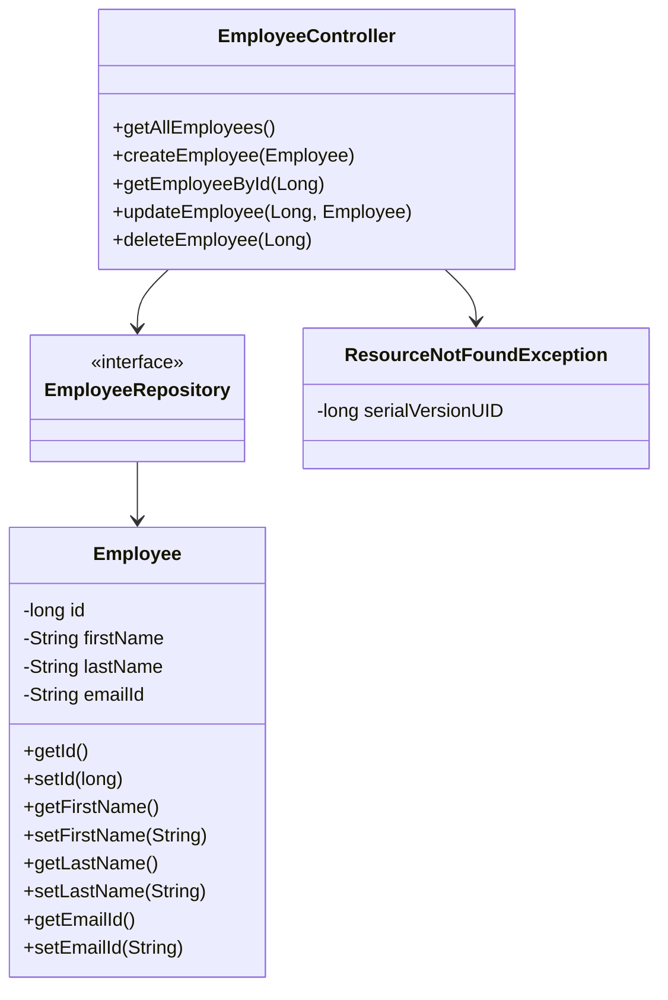

# Introduction

<SwmMention uid="jk3EBMStUvca6XHe2WgXNCGeC9q1">[Asarudheen Kaleel Rahman](mailto:kaleelrahman.asarudheen@in.bosch.com)</SwmMention>-Owner

This document will walk you through the implementation of the Employee management feature in the Spring Boot backend. The purpose of this feature is to manage employee data through a RESTful API.

We will cover:

1. How the <SwmToken path="/springboot-backend/src/main/java/com/bosch/ec/controller/EmployeeController.java" pos="26:4:4" line-data="public class EmployeeController {">`EmployeeController`</SwmToken> handles CRUD operations.
2. The role of the <SwmToken path="/springboot-backend/src/main/java/com/bosch/ec/controller/EmployeeController.java" pos="19:10:10" line-data="import com.bosch.ec.repository.EmployeeRepository;">`EmployeeRepository`</SwmToken> in data access.
3. The use of the <SwmToken path="/springboot-backend/src/main/java/com/bosch/ec/controller/EmployeeController.java" pos="20:10:10" line-data="import com.bosch.ec.exception.ResourceNotFoundException;">`ResourceNotFoundException`</SwmToken> for error handling.
4. The structure of the Employee entity.

# Code flow

## <SwmToken path="/springboot-backend/src/main/java/com/bosch/ec/controller/EmployeeController.java" pos="26:4:4" line-data="public class EmployeeController {">`EmployeeController`</SwmToken> and CRUD operations

<SwmSnippet path="/springboot-backend/src/main/java/com/bosch/ec/controller/EmployeeController.java" line="19">

---

The <SwmToken path="/springboot-backend/src/main/java/com/bosch/ec/controller/EmployeeController.java" pos="26:4:4" line-data="public class EmployeeController {">`EmployeeController`</SwmToken> is the main entry point for handling HTTP requests related to employees. It is annotated with <SwmToken path="/springboot-backend/src/main/java/com/bosch/ec/controller/EmployeeController.java" pos="24:0:1" line-data="@RestController">`@RestController`</SwmToken> and <SwmToken path="/springboot-backend/src/main/java/com/bosch/ec/controller/EmployeeController.java" pos="25:0:1" line-data="@RequestMapping(&quot;/api/v1/&quot;)">`@RequestMapping`</SwmToken> to define the base URL for the API.

```
import com.bosch.ec.repository.EmployeeRepository;
import com.bosch.ec.exception.ResourceNotFoundException;
import com.bosch.ec.model.Employee;

@CrossOrigin(origins = "http://localhost:4200")
@RestController
@RequestMapping("/api/v1/")
public class EmployeeController {
```

---

</SwmSnippet>

The controller uses <SwmToken path="/springboot-backend/src/main/java/com/bosch/ec/controller/EmployeeController.java" pos="19:10:10" line-data="import com.bosch.ec.repository.EmployeeRepository;">`EmployeeRepository`</SwmToken> to interact with the database. It provides endpoints for creating, reading, updating, and deleting employees.

### Get all employees

<SwmSnippet path="/springboot-backend/src/main/java/com/bosch/ec/controller/EmployeeController.java" line="28">

---

The <SwmToken path="/springboot-backend/src/main/java/com/bosch/ec/controller/EmployeeController.java" pos="33:8:8" line-data="	public List&lt;Employee&gt; getAllEmployees(){">`getAllEmployees`</SwmToken> method retrieves all employee records from the database.

```
	@Autowired
	private EmployeeRepository employeeRepository;
	
	// get all employees
	@GetMapping("/employees")
	public List<Employee> getAllEmployees(){
		return employeeRepository.findAll();
	}		
```

---

</SwmSnippet>

### Create and get employee by ID

<SwmSnippet path="/springboot-backend/src/main/java/com/bosch/ec/controller/EmployeeController.java" line="37">

---

The <SwmToken path="/springboot-backend/src/main/java/com/bosch/ec/controller/EmployeeController.java" pos="39:5:5" line-data="	public Employee createEmployee(@RequestBody Employee employee) {">`createEmployee`</SwmToken> method allows for adding a new employee, while <SwmToken path="/springboot-backend/src/main/java/com/bosch/ec/controller/EmployeeController.java" pos="45:8:8" line-data="	public ResponseEntity&lt;Employee&gt; getEmployeeById(@PathVariable Long id) {">`getEmployeeById`</SwmToken> retrieves an employee by their ID, throwing a <SwmToken path="/springboot-backend/src/main/java/com/bosch/ec/controller/EmployeeController.java" pos="47:11:11" line-data="				.orElseThrow(() -&gt; new ResourceNotFoundException(&quot;Employee not exist with id :&quot; + id));">`ResourceNotFoundException`</SwmToken> if not found.

```
	// create employee rest api
	@PostMapping("/employees")
	public Employee createEmployee(@RequestBody Employee employee) {
		return employeeRepository.save(employee);
	}
	
	// get employee by id rest api
	@GetMapping("/employees/{id}")
	public ResponseEntity<Employee> getEmployeeById(@PathVariable Long id) {
		Employee employee = employeeRepository.findById(id)
				.orElseThrow(() -> new ResourceNotFoundException("Employee not exist with id :" + id));
		return ResponseEntity.ok(employee);
	}
```

---

</SwmSnippet>

### Update employee

<SwmSnippet path="/springboot-backend/src/main/java/com/bosch/ec/controller/EmployeeController.java" line="51">

---

The <SwmToken path="/springboot-backend/src/main/java/com/bosch/ec/controller/EmployeeController.java" pos="54:8:8" line-data="	public ResponseEntity&lt;Employee&gt; updateEmployee(@PathVariable Long id, @RequestBody Employee employeeDetails){">`updateEmployee`</SwmToken> method updates an existing employee's details. It first checks if the employee exists, then updates the necessary fields.

```
	// update employee rest api
	
	@PutMapping("/employees/{id}")
	public ResponseEntity<Employee> updateEmployee(@PathVariable Long id, @RequestBody Employee employeeDetails){
		Employee employee = employeeRepository.findById(id)
				.orElseThrow(() -> new ResourceNotFoundException("Employee not exist with id :" + id));
		
		employee.setFirstName(employeeDetails.getFirstName());
		employee.setLastName(employeeDetails.getLastName());
		employee.setEmailId(employeeDetails.getEmailId());
```

---

</SwmSnippet>

<SwmSnippet path="/springboot-backend/src/main/java/com/bosch/ec/controller/EmployeeController.java" line="62">

---

The updated employee is then saved back to the database.

```
		Employee updatedEmployee = employeeRepository.save(employee);
		return ResponseEntity.ok(updatedEmployee);
	}
```

---

</SwmSnippet>

### Delete employee

<SwmSnippet path="/springboot-backend/src/main/java/com/bosch/ec/controller/EmployeeController.java" line="66">

---

The <SwmToken path="/springboot-backend/src/main/java/com/bosch/ec/controller/EmployeeController.java" pos="68:13:13" line-data="	public ResponseEntity&lt;Map&lt;String, Boolean&gt;&gt; deleteEmployee(@PathVariable Long id){">`deleteEmployee`</SwmToken> method removes an employee from the database. It confirms the employee's existence before deletion.

```
	// delete employee rest api
	@DeleteMapping("/employees/{id}")
	public ResponseEntity<Map<String, Boolean>> deleteEmployee(@PathVariable Long id){
		Employee employee = employeeRepository.findById(id)
				.orElseThrow(() -> new ResourceNotFoundException("Employee not exist with id :" + id));
		
		employeeRepository.delete(employee);
		Map<String, Boolean> response = new HashMap<>();
		response.put("deleted", Boolean.TRUE);
		return ResponseEntity.ok(response);
	}
```

---

</SwmSnippet>

## Exception handling with <SwmToken path="/springboot-backend/src/main/java/com/bosch/ec/controller/EmployeeController.java" pos="20:10:10" line-data="import com.bosch.ec.exception.ResourceNotFoundException;">`ResourceNotFoundException`</SwmToken>

## Employee entity structure

<SwmSnippet path="/springboot-backend/src/main/java/com/bosch/ec/model/Employee.java" line="1">

---

The <SwmToken path="/springboot-backend/src/main/java/com/bosch/ec/model/Employee.java" pos="7:4:4" line-data="public class Employee {">`Employee`</SwmToken> class represents the employee entity. It is annotated with <SwmToken path="/springboot-backend/src/main/java/com/bosch/ec/model/Employee.java" pos="5:0:1" line-data="@Entity">`@Entity`</SwmToken> and <SwmToken path="/springboot-backend/src/main/java/com/bosch/ec/model/Employee.java" pos="6:0:1" line-data="@Table(name = &quot;employees&quot;)">`@Table`</SwmToken> to map it to the database table.

```
package com.bosch.ec.model;

import jakarta.persistence.*;

@Entity
@Table(name = "employees")
public class Employee {
```

---

</SwmSnippet>

<SwmSnippet path="/springboot-backend/src/main/java/com/bosch/ec/model/Employee.java" line="24">

---

The class provides a default constructor, a parameterized constructor, and getter and setter methods for each field.

```
	}
	
	public Employee(String firstName, String lastName, String emailId) {
		super();
		this.firstName = firstName;
		this.lastName = lastName;
		this.emailId = emailId;
	}
	public long getId() {
		return id;
	}
	public void setId(long id) {
		this.id = id;
	}
	public String getFirstName() {
		return firstName;
	}
	public void setFirstName(String firstName) {
		this.firstName = firstName;
	}
	public String getLastName() {
		return lastName;
	}
	public void setLastName(String lastName) {
		this.lastName = lastName;
	}
	public String getEmailId() {
		return emailId;
	}
	public void setEmailId(String emailId) {
		this.emailId = emailId;
	}
}
```

---

</SwmSnippet>

## <SwmToken path="/springboot-backend/src/main/java/com/bosch/ec/controller/EmployeeController.java" pos="19:10:10" line-data="import com.bosch.ec.repository.EmployeeRepository;">`EmployeeRepository`</SwmToken> for data access

<SwmSnippet path="/springboot-backend/src/main/java/com/bosch/ec/repository/EmployeeRepository.java" line="1">

---

The <SwmToken path="/springboot-backend/src/main/java/com/bosch/ec/repository/EmployeeRepository.java" pos="9:4:4" line-data="public interface EmployeeRepository extends JpaRepository&lt;Employee, Long&gt;{">`EmployeeRepository`</SwmToken> interface extends <SwmToken path="/springboot-backend/src/main/java/com/bosch/ec/repository/EmployeeRepository.java" pos="3:12:12" line-data="import org.springframework.data.jpa.repository.JpaRepository;">`JpaRepository`</SwmToken>, providing CRUD operations for the <SwmToken path="/springboot-backend/src/main/java/com/bosch/ec/repository/EmployeeRepository.java" pos="6:10:10" line-data="import com.bosch.ec.model.Employee;">`Employee`</SwmToken> entity without requiring boilerplate code.

```
package com.bosch.ec.repository;

import org.springframework.data.jpa.repository.JpaRepository;
import org.springframework.stereotype.Repository;

import com.bosch.ec.model.Employee;

@Repository
public interface EmployeeRepository extends JpaRepository<Employee, Long>{

}

```

---

</SwmSnippet>

## Application entry point

<SwmSnippet path="/springboot-backend/src/main/java/com/bosch/ec/SpringbootBackendApplication.java" line="1">

---

The <SwmToken path="/springboot-backend/src/main/java/com/bosch/ec/SpringbootBackendApplication.java" pos="7:4:4" line-data="public class SpringbootBackendApplication {">`SpringbootBackendApplication`</SwmToken> class contains the <SwmToken path="/springboot-backend/src/main/java/com/bosch/ec/SpringbootBackendApplication.java" pos="9:7:7" line-data="	public static void main(String[] args) {">`main`</SwmToken> method, which is the entry point for the Spring Boot application.

```
package com.bosch.ec;

import org.springframework.boot.SpringApplication;
import org.springframework.boot.autoconfigure.SpringBootApplication;

@SpringBootApplication
public class SpringbootBackendApplication {

	public static void main(String[] args) {
		SpringApplication.run(SpringbootBackendApplication.class, args);
	}

}

```

---

</SwmSnippet>

# Mermaid Diagram



# Conclusion

This document outlined the design and implementation of the Employee management feature in the Spring Boot backend. We explored how the <SwmToken path="/springboot-backend/src/main/java/com/bosch/ec/controller/EmployeeController.java" pos="26:4:4" line-data="public class EmployeeController {">`EmployeeController`</SwmToken> manages CRUD operations, the role of <SwmToken path="/springboot-backend/src/main/java/com/bosch/ec/controller/EmployeeController.java" pos="19:10:10" line-data="import com.bosch.ec.repository.EmployeeRepository;">`EmployeeRepository`</SwmToken> in data access, the use of <SwmToken path="/springboot-backend/src/main/java/com/bosch/ec/controller/EmployeeController.java" pos="20:10:10" line-data="import com.bosch.ec.exception.ResourceNotFoundException;">`ResourceNotFoundException`</SwmToken> for error handling, and the structure of the <SwmToken path="/springboot-backend/src/main/java/com/bosch/ec/controller/EmployeeController.java" pos="21:10:10" line-data="import com.bosch.ec.model.Employee;">`Employee`</SwmToken> entity. This setup provides a robust foundation for managing employee data through a RESTful API.

<SwmMeta version="3.0.0" repo-id="Z2l0aHViJTNBJTNBZWFzeUNvbmZpZyUzQSUzQUFzYXJ1ZGhlZW5L" repo-name="easyConfig"><sup>Powered by [Swimm](https://app.swimm.io/)</sup></SwmMeta>
