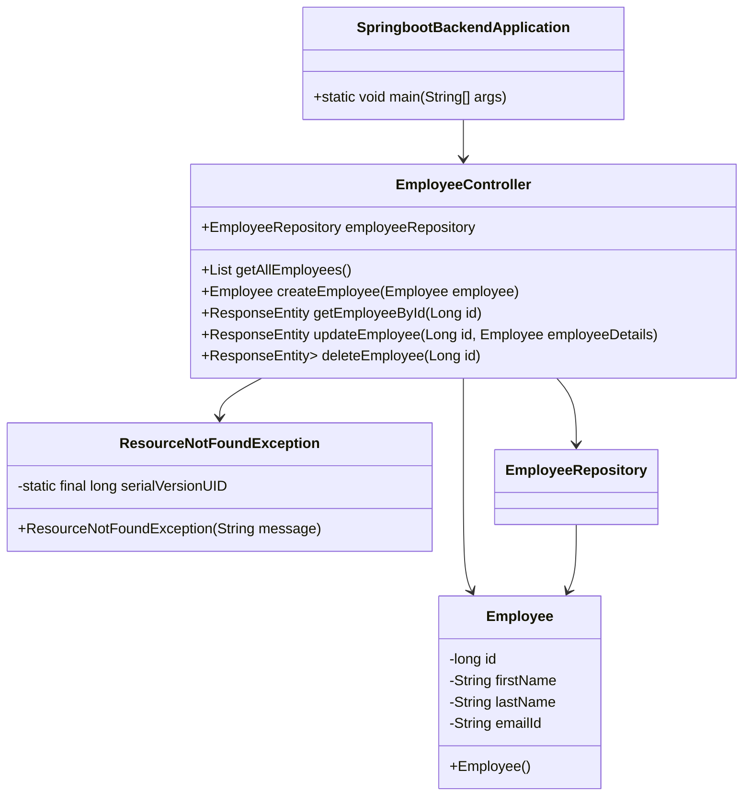

# Introduction

This document will walk you through the implementation of the "Mermaid-Diagram" feature in the Spring Boot backend. The purpose of this feature is to manage employee data through a RESTful API. We will cover:

1. How the <SwmToken path="/springboot-backend/src/main/java/com/bosch/ec/controller/EmployeeController.java" pos="26:4:4" line-data="public class EmployeeController {">`EmployeeController`</SwmToken> is structured to handle CRUD operations.
2. The role of the <SwmToken path="/springboot-backend/src/main/java/com/bosch/ec/controller/EmployeeController.java" pos="20:10:10" line-data="import com.bosch.ec.exception.ResourceNotFoundException;">`ResourceNotFoundException`</SwmToken> in error handling.
3. The design of the Employee model and its persistence.
4. The integration of the <SwmToken path="/springboot-backend/src/main/java/com/bosch/ec/controller/EmployeeController.java" pos="19:10:10" line-data="import com.bosch.ec.repository.EmployeeRepository;">`EmployeeRepository`</SwmToken> for database operations.

# <SwmToken path="/springboot-backend/src/main/java/com/bosch/ec/controller/EmployeeController.java" pos="26:4:4" line-data="public class EmployeeController {">`EmployeeController`</SwmToken> structure

<SwmSnippet path="/springboot-backend/src/main/java/com/bosch/ec/controller/EmployeeController.java" line="19">

---

The <SwmToken path="/springboot-backend/src/main/java/com/bosch/ec/controller/EmployeeController.java" pos="26:4:4" line-data="public class EmployeeController {">`EmployeeController`</SwmToken> is the main entry point for handling HTTP requests related to employee data. It is annotated with <SwmToken path="/springboot-backend/src/main/java/com/bosch/ec/controller/EmployeeController.java" pos="24:0:1" line-data="@RestController">`@RestController`</SwmToken> and <SwmToken path="/springboot-backend/src/main/java/com/bosch/ec/controller/EmployeeController.java" pos="25:0:1" line-data="@RequestMapping(&quot;/api/v1/&quot;)">`@RequestMapping`</SwmToken> to define the base URL for the API.

```
import com.bosch.ec.repository.EmployeeRepository;
import com.bosch.ec.exception.ResourceNotFoundException;
import com.bosch.ec.model.Employee;

@CrossOrigin(origins = "http://localhost:4200")
@RestController
@RequestMapping("/api/v1/")
public class EmployeeController {
```

---

</SwmSnippet>

<SwmSnippet path="/springboot-backend/src/main/java/com/bosch/ec/controller/EmployeeController.java" line="28">

---

The controller uses dependency injection to access the <SwmToken path="/springboot-backend/src/main/java/com/bosch/ec/controller/EmployeeController.java" pos="29:3:3" line-data="	private EmployeeRepository employeeRepository;">`EmployeeRepository`</SwmToken>, which is crucial for performing database operations.

```
	@Autowired
	private EmployeeRepository employeeRepository;
	
	// get all employees
	@GetMapping("/employees")
	public List<Employee> getAllEmployees(){
		return employeeRepository.findAll();
	}		
```

---

</SwmSnippet>

# CRUD operations

The controller provides endpoints for creating, reading, updating, and deleting employee records. Each operation is mapped to a specific HTTP method and URL pattern.

## Create and read operations

<SwmSnippet path="/springboot-backend/src/main/java/com/bosch/ec/controller/EmployeeController.java" line="37">

---

The <SwmToken path="/springboot-backend/src/main/java/com/bosch/ec/controller/EmployeeController.java" pos="39:5:5" line-data="	public Employee createEmployee(@RequestBody Employee employee) {">`createEmployee`</SwmToken> method handles POST requests to add new employees, while <SwmToken path="/springboot-backend/src/main/java/com/bosch/ec/controller/EmployeeController.java" pos="33:8:8" line-data="	public List&lt;Employee&gt; getAllEmployees(){">`getAllEmployees`</SwmToken> and <SwmToken path="/springboot-backend/src/main/java/com/bosch/ec/controller/EmployeeController.java" pos="45:8:8" line-data="	public ResponseEntity&lt;Employee&gt; getEmployeeById(@PathVariable Long id) {">`getEmployeeById`</SwmToken> handle GET requests to retrieve employee data.

```
	// create employee rest api
	@PostMapping("/employees")
	public Employee createEmployee(@RequestBody Employee employee) {
		return employeeRepository.save(employee);
	}
	
	// get employee by id rest api
	@GetMapping("/employees/{id}")
	public ResponseEntity<Employee> getEmployeeById(@PathVariable Long id) {
		Employee employee = employeeRepository.findById(id)
				.orElseThrow(() -> new ResourceNotFoundException("Employee not exist with id :" + id));
		return ResponseEntity.ok(employee);
	}
```

---

</SwmSnippet>

## Update operation

<SwmSnippet path="/springboot-backend/src/main/java/com/bosch/ec/controller/EmployeeController.java" line="51">

---

The <SwmToken path="/springboot-backend/src/main/java/com/bosch/ec/controller/EmployeeController.java" pos="54:8:8" line-data="	public ResponseEntity&lt;Employee&gt; updateEmployee(@PathVariable Long id, @RequestBody Employee employeeDetails){">`updateEmployee`</SwmToken> method processes PUT requests to modify existing employee records. It retrieves the employee by ID, updates the fields, and saves the changes.

```
	// update employee rest api
	
	@PutMapping("/employees/{id}")
	public ResponseEntity<Employee> updateEmployee(@PathVariable Long id, @RequestBody Employee employeeDetails){
		Employee employee = employeeRepository.findById(id)
				.orElseThrow(() -> new ResourceNotFoundException("Employee not exist with id :" + id));
		
		employee.setFirstName(employeeDetails.getFirstName());
		employee.setLastName(employeeDetails.getLastName());
		employee.setEmailId(employeeDetails.getEmailId());
		
		Employee updatedEmployee = employeeRepository.save(employee);
		return ResponseEntity.ok(updatedEmployee);
	}
```

---

</SwmSnippet>

## Delete operation

<SwmSnippet path="/springboot-backend/src/main/java/com/bosch/ec/controller/EmployeeController.java" line="66">

---

The <SwmToken path="/springboot-backend/src/main/java/com/bosch/ec/controller/EmployeeController.java" pos="68:13:13" line-data="	public ResponseEntity&lt;Map&lt;String, Boolean&gt;&gt; deleteEmployee(@PathVariable Long id){">`deleteEmployee`</SwmToken> method handles DELETE requests to remove employee records. It confirms the deletion by returning a response map.

```
	// delete employee rest api
	@DeleteMapping("/employees/{id}")
	public ResponseEntity<Map<String, Boolean>> deleteEmployee(@PathVariable Long id){
		Employee employee = employeeRepository.findById(id)
				.orElseThrow(() -> new ResourceNotFoundException("Employee not exist with id :" + id));
		
		employeeRepository.delete(employee);
		Map<String, Boolean> response = new HashMap<>();
		response.put("deleted", Boolean.TRUE);
		return ResponseEntity.ok(response);
	}
```

---

</SwmSnippet>

# Error handling with <SwmToken path="/springboot-backend/src/main/java/com/bosch/ec/controller/EmployeeController.java" pos="20:10:10" line-data="import com.bosch.ec.exception.ResourceNotFoundException;">`ResourceNotFoundException`</SwmToken>

<SwmSnippet path="/springboot-backend/src/main/java/com/bosch/ec/exception/ResourceNotFoundException.java" line="1">

---

The <SwmToken path="/springboot-backend/src/main/java/com/bosch/ec/exception/ResourceNotFoundException.java" pos="7:4:4" line-data="public class ResourceNotFoundException extends RuntimeException{">`ResourceNotFoundException`</SwmToken> is a custom exception used to handle cases where an employee is not found in the database. It returns a 404 status code when triggered.

```
package com.bosch.ec.exception;

import org.springframework.http.HttpStatus;
import org.springframework.web.bind.annotation.ResponseStatus;

@ResponseStatus(value = HttpStatus.NOT_FOUND)
public class ResourceNotFoundException extends RuntimeException{

	private static final long serialVersionUID = 1L;
	
	public ResourceNotFoundException(String message) {
		super(message);
	}
}
```

---

</SwmSnippet>

# Employee model design

<SwmSnippet path="/springboot-backend/src/main/java/com/bosch/ec/model/Employee.java" line="1">

---

The <SwmToken path="/springboot-backend/src/main/java/com/bosch/ec/model/Employee.java" pos="7:4:4" line-data="public class Employee {">`Employee`</SwmToken> class represents the employee entity. It is annotated with <SwmToken path="/springboot-backend/src/main/java/com/bosch/ec/model/Employee.java" pos="5:0:1" line-data="@Entity">`@Entity`</SwmToken> and <SwmToken path="/springboot-backend/src/main/java/com/bosch/ec/model/Employee.java" pos="6:0:1" line-data="@Table(name = &quot;employees&quot;)">`@Table`</SwmToken> to map it to the database table.

```
package com.bosch.ec.model;

import jakarta.persistence.*;

@Entity
@Table(name = "employees")
public class Employee {
```

---

</SwmSnippet>

<SwmSnippet path="/springboot-backend/src/main/java/com/bosch/ec/model/Employee.java" line="9">

---

The class includes fields for ID, first name, last name, and email, each mapped to a database column.

```
	@Id
	@GeneratedValue(strategy = GenerationType.IDENTITY)
	private long id;
	
	@Column(name = "first_name")
	private String firstName;

	@Column(name = "last_name")
	private String lastName;
	
	@Column(name = "email_id")
	private String emailId;
	
	public Employee() {
```

---

</SwmSnippet>

# <SwmToken path="/springboot-backend/src/main/java/com/bosch/ec/controller/EmployeeController.java" pos="19:10:10" line-data="import com.bosch.ec.repository.EmployeeRepository;">`EmployeeRepository`</SwmToken> integration

<SwmSnippet path="/springboot-backend/src/main/java/com/bosch/ec/repository/EmployeeRepository.java" line="1">

---

The <SwmToken path="/springboot-backend/src/main/java/com/bosch/ec/repository/EmployeeRepository.java" pos="9:4:4" line-data="public interface EmployeeRepository extends JpaRepository&lt;Employee, Long&gt;{">`EmployeeRepository`</SwmToken> interface extends <SwmToken path="/springboot-backend/src/main/java/com/bosch/ec/repository/EmployeeRepository.java" pos="3:12:12" line-data="import org.springframework.data.jpa.repository.JpaRepository;">`JpaRepository`</SwmToken>, providing CRUD operations for the <SwmToken path="/springboot-backend/src/main/java/com/bosch/ec/repository/EmployeeRepository.java" pos="6:10:10" line-data="import com.bosch.ec.model.Employee;">`Employee`</SwmToken> entity without requiring boilerplate code.

```
package com.bosch.ec.repository;

import org.springframework.data.jpa.repository.JpaRepository;
import org.springframework.stereotype.Repository;

import com.bosch.ec.model.Employee;

@Repository
public interface EmployeeRepository extends JpaRepository<Employee, Long>{

}

```

---

</SwmSnippet>

# Application entry point

<SwmSnippet path="/springboot-backend/src/main/java/com/bosch/ec/SpringbootBackendApplication.java" line="1">

---

The <SwmToken path="/springboot-backend/src/main/java/com/bosch/ec/SpringbootBackendApplication.java" pos="7:4:4" line-data="public class SpringbootBackendApplication {">`SpringbootBackendApplication`</SwmToken> class contains the <SwmToken path="/springboot-backend/src/main/java/com/bosch/ec/SpringbootBackendApplication.java" pos="9:7:7" line-data="	public static void main(String[] args) {">`main`</SwmToken> method, which launches the Spring Boot application.

```
package com.bosch.ec;

import org.springframework.boot.SpringApplication;
import org.springframework.boot.autoconfigure.SpringBootApplication;

@SpringBootApplication
public class SpringbootBackendApplication {

	public static void main(String[] args) {
		SpringApplication.run(SpringbootBackendApplication.class, args);
	}

}

```

---

</SwmSnippet>

# Class Diagram



# Conclusion

This document outlined the design and implementation of the "Mermaid-Diagram" feature, focusing on the structure of the <SwmToken path="/springboot-backend/src/main/java/com/bosch/ec/controller/EmployeeController.java" pos="26:4:4" line-data="public class EmployeeController {">`EmployeeController`</SwmToken>, error handling with <SwmToken path="/springboot-backend/src/main/java/com/bosch/ec/controller/EmployeeController.java" pos="20:10:10" line-data="import com.bosch.ec.exception.ResourceNotFoundException;">`ResourceNotFoundException`</SwmToken>, the <SwmToken path="/springboot-backend/src/main/java/com/bosch/ec/controller/EmployeeController.java" pos="21:10:10" line-data="import com.bosch.ec.model.Employee;">`Employee`</SwmToken> model, and the integration of <SwmToken path="/springboot-backend/src/main/java/com/bosch/ec/controller/EmployeeController.java" pos="19:10:10" line-data="import com.bosch.ec.repository.EmployeeRepository;">`EmployeeRepository`</SwmToken>. These components work together to provide a robust API for managing employee data.

<SwmMeta version="3.0.0" repo-id="Z2l0aHViJTNBJTNBZWFzeUNvbmZpZyUzQSUzQUFzYXJ1ZGhlZW5L" repo-name="easyConfig"><sup>Powered by [Swimm](https://app.swimm.io/)</sup></SwmMeta>
