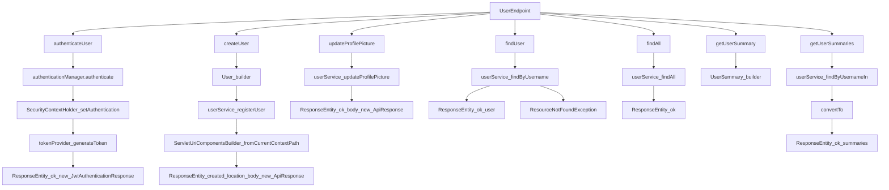

# Introduction

This document will walk you through the implementation of the <SwmToken path="/auth-service/src/main/java/com/clone/instagram/authservice/endpoint/UserEndpoint.java" pos="31:4:4" line-data="public class UserEndpoint {">`UserEndpoint`</SwmToken> in the Instagram clone's authentication service. The <SwmToken path="/auth-service/src/main/java/com/clone/instagram/authservice/endpoint/UserEndpoint.java" pos="31:4:4" line-data="public class UserEndpoint {">`UserEndpoint`</SwmToken> is responsible for handling user-related operations such as authentication, registration, profile updates, and retrieval of user information.

We will cover:

1. Why authentication and user management are separated into distinct methods.
2. The design decision behind using JWT for authentication.
3. How user registration and profile updates are handled.
4. The approach for retrieving user information and summaries.

# Authentication process

<SwmSnippet path="/auth-service/src/main/java/com/clone/instagram/authservice/endpoint/UserEndpoint.java" line="43">

---

The authentication process begins with the <SwmToken path="/auth-service/src/main/java/com/clone/instagram/authservice/endpoint/UserEndpoint.java" pos="44:6:6" line-data="    public ResponseEntity&lt;?&gt; authenticateUser(@Valid @RequestBody LoginRequest loginRequest) {">`authenticateUser`</SwmToken> method. This method is responsible for validating user credentials and generating a JWT token for authenticated sessions.

```
    @PostMapping("/signin")
    public ResponseEntity<?> authenticateUser(@Valid @RequestBody LoginRequest loginRequest) {

        Authentication authentication = authenticationManager.authenticate(
                new UsernamePasswordAuthenticationToken(
                        loginRequest.getUsername(),
                        loginRequest.getPassword()
                )
        );
```

---

</SwmSnippet>

<SwmSnippet path="/auth-service/src/main/java/com/clone/instagram/authservice/endpoint/UserEndpoint.java" line="53">

---

Once the authentication is successful, the JWT token is generated and returned to the client. This token is crucial for maintaining session state without server-side storage.

```
        SecurityContextHolder.getContext().setAuthentication(authentication);

        String jwt = tokenProvider.generateToken(authentication);
        return ResponseEntity.ok(new JwtAuthenticationResponse(jwt));
    }
```

---

</SwmSnippet>

# User registration

<SwmSnippet path="/auth-service/src/main/java/com/clone/instagram/authservice/endpoint/UserEndpoint.java" line="59">

---

User registration is handled by the <SwmToken path="/auth-service/src/main/java/com/clone/instagram/authservice/endpoint/UserEndpoint.java" pos="60:6:6" line-data="    public ResponseEntity&lt;?&gt; createUser(@Valid @RequestBody SignUpRequest payload) {">`createUser`</SwmToken> method. This method constructs a <SwmToken path="/auth-service/src/main/java/com/clone/instagram/authservice/endpoint/UserEndpoint.java" pos="63:1:1" line-data="        User user = User">`User`</SwmToken> object from the incoming request payload and attempts to register the user.

```
    @PostMapping(value = "/users", produces = MediaType.APPLICATION_JSON_VALUE)
    public ResponseEntity<?> createUser(@Valid @RequestBody SignUpRequest payload) {
        log.info("creating user {}", payload.getUsername());
```

---

</SwmSnippet>

<SwmSnippet path="/auth-service/src/main/java/com/clone/instagram/authservice/endpoint/UserEndpoint.java" line="63">

---

The <SwmToken path="/auth-service/src/main/java/com/clone/instagram/authservice/endpoint/UserEndpoint.java" pos="63:1:1" line-data="        User user = User">`User`</SwmToken> object is built with the necessary details, including username, email, and password, along with a profile.

```
        User user = User
                .builder()
                .username(payload.getUsername())
                .email(payload.getEmail())
                .password(payload.getPassword())
                .userProfile(Profile
                        .builder()
                        .displayName(payload.getName())
                        .build())
                .build();
```

---

</SwmSnippet>

<SwmSnippet path="/auth-service/src/main/java/com/clone/instagram/authservice/endpoint/UserEndpoint.java" line="74">

---

The registration process involves checking for existing usernames or emails to prevent duplicates. If a conflict is detected, a <SwmToken path="/auth-service/src/main/java/com/clone/instagram/authservice/endpoint/UserEndpoint.java" pos="77:5:5" line-data="            throw new BadRequestException(e.getMessage());">`BadRequestException`</SwmToken> is thrown.

```
        try {
            userService.registerUser(user);
        } catch (UsernameAlreadyExistsException | EmailAlreadyExistsException e) {
            throw new BadRequestException(e.getMessage());
        }
```

---

</SwmSnippet>

<SwmSnippet path="/auth-service/src/main/java/com/clone/instagram/authservice/endpoint/UserEndpoint.java" line="80">

---

Upon successful registration, a URI pointing to the newly created user resource is generated and returned.

```
        URI location = ServletUriComponentsBuilder
                .fromCurrentContextPath().path("/users/{username}")
                .buildAndExpand(user.getUsername()).toUri();

        return ResponseEntity
                .created(location)
                .body(new ApiResponse(true,"User registered successfully"));
    }
```

---

</SwmSnippet>

# Profile updates

<SwmSnippet path="/auth-service/src/main/java/com/clone/instagram/authservice/endpoint/UserEndpoint.java" line="89">

---

Profile updates, such as changing the profile picture, are managed by the <SwmToken path="/auth-service/src/main/java/com/clone/instagram/authservice/endpoint/UserEndpoint.java" pos="91:7:7" line-data="    public ResponseEntity &lt;?&gt; updateProfilePicture(">`updateProfilePicture`</SwmToken> method. This method ensures that only authenticated users can update their profile pictures.

```
    @PutMapping("/users/me/picture")
    @PreAuthorize("hasRole('USER')")
    public ResponseEntity <?> updateProfilePicture(
            @RequestBody String profilePicture,
            @AuthenticationPrincipal InstaUserDetails userDetails) {

        userService.updateProfilePicture(profilePicture, userDetails.getId());

        return ResponseEntity
                .ok()
                .body(new ApiResponse(true,"Profile picture updated successfully"));
    }
```

---

</SwmSnippet>

# Retrieving user information

<SwmSnippet path="/auth-service/src/main/java/com/clone/instagram/authservice/endpoint/UserEndpoint.java" line="102">

---

The <SwmToken path="/auth-service/src/main/java/com/clone/instagram/authservice/endpoint/UserEndpoint.java" pos="103:6:6" line-data="    public ResponseEntity&lt;?&gt; findUser(@PathVariable(&quot;username&quot;) String username) {">`findUser`</SwmToken> method retrieves user details based on the username. It logs the retrieval process and handles cases where the user is not found.

```
    @GetMapping(value = "/users/{username}", produces = MediaType.APPLICATION_JSON_VALUE)
    public ResponseEntity<?> findUser(@PathVariable("username") String username) {
        log.info("retrieving user {}", username);

        return  userService
                .findByUsername(username)
                .map(user -> ResponseEntity.ok(user))
                .orElseThrow(() -> new ResourceNotFoundException(username));
    }
```

---

</SwmSnippet>

<SwmSnippet path="/auth-service/src/main/java/com/clone/instagram/authservice/endpoint/UserEndpoint.java" line="112">

---

For retrieving all users, the <SwmToken path="/auth-service/src/main/java/com/clone/instagram/authservice/endpoint/UserEndpoint.java" pos="113:6:6" line-data="    public ResponseEntity&lt;?&gt; findAll() {">`findAll`</SwmToken> method is used. It logs the action and returns a list of all users.

```
    @GetMapping(value = "/users", produces = MediaType.APPLICATION_JSON_VALUE)
    public ResponseEntity<?> findAll() {
        log.info("retrieving all users");

        return ResponseEntity
                .ok(userService.findAll());
    }
```

---

</SwmSnippet>

# User summaries

<SwmSnippet path="/auth-service/src/main/java/com/clone/instagram/authservice/endpoint/UserEndpoint.java" line="120">

---

The <SwmToken path="/auth-service/src/main/java/com/clone/instagram/authservice/endpoint/UserEndpoint.java" pos="134:6:6" line-data="    public ResponseEntity&lt;?&gt; getUserSummary(@PathVariable(&quot;username&quot;) String username) {">`getUserSummary`</SwmToken> method provides a summary of the current authenticated user. This method is protected to ensure only authenticated users can access their summaries.

```
    @GetMapping(value = "/users/me", produces = MediaType.APPLICATION_JSON_VALUE)
    @PreAuthorize("hasRole('USER')")
    @ResponseStatus(HttpStatus.OK)
    public UserSummary getCurrentUser(@AuthenticationPrincipal InstaUserDetails userDetails) {
        return UserSummary
                .builder()
                .id(userDetails.getId())
                .username(userDetails.getUsername())
                .name(userDetails.getUserProfile().getDisplayName())
                .profilePicture(userDetails.getUserProfile().getProfilePictureUrl())
                .build();
    }
```

---

</SwmSnippet>

<SwmSnippet path="/auth-service/src/main/java/com/clone/instagram/authservice/endpoint/UserEndpoint.java" line="143">

---

To retrieve summaries for specific users, the <SwmToken path="/auth-service/src/main/java/com/clone/instagram/authservice/endpoint/UserEndpoint.java" pos="144:6:6" line-data="    public ResponseEntity&lt;?&gt; getUserSummaries(@RequestBody List&lt;String&gt; usernames) {">`getUserSummaries`</SwmToken> method processes a list of usernames and returns their summaries.

```
    @PostMapping(value = "/users/summary/in", produces = MediaType.APPLICATION_JSON_VALUE)
    public ResponseEntity<?> getUserSummaries(@RequestBody List<String> usernames) {
        log.info("retrieving summaries for {} usernames", usernames.size());

        List<UserSummary> summaries =
                userService
                        .findByUsernameIn(usernames)
                        .stream()
                        .map(user -> convertTo(user))
                        .collect(Collectors.toList());

        return ResponseEntity.ok(summaries);

    }
```

---

</SwmSnippet>

<SwmSnippet path="/auth-service/src/main/java/com/clone/instagram/authservice/endpoint/UserEndpoint.java" line="158">

---

The <SwmToken path="/auth-service/src/main/java/com/clone/instagram/authservice/endpoint/UserEndpoint.java" pos="158:5:5" line-data="    private UserSummary convertTo(User user) {">`convertTo`</SwmToken> method is a utility function that converts a <SwmToken path="/auth-service/src/main/java/com/clone/instagram/authservice/endpoint/UserEndpoint.java" pos="158:7:7" line-data="    private UserSummary convertTo(User user) {">`User`</SwmToken> object into a <SwmToken path="/auth-service/src/main/java/com/clone/instagram/authservice/endpoint/UserEndpoint.java" pos="158:3:3" line-data="    private UserSummary convertTo(User user) {">`UserSummary`</SwmToken> object, which is used in the summary retrieval methods.

```
    private UserSummary convertTo(User user) {
        return UserSummary
                .builder()
                .id(user.getId())
                .username(user.getUsername())
                .name(user.getUserProfile().getDisplayName())
                .profilePicture(user.getUserProfile().getProfilePictureUrl())
                .build();
    }
}
```

---

</SwmSnippet>

&nbsp;



# Conclusion

The <SwmToken path="/auth-service/src/main/java/com/clone/instagram/authservice/endpoint/UserEndpoint.java" pos="31:4:4" line-data="public class UserEndpoint {">`UserEndpoint`</SwmToken> is designed to handle various user-related operations efficiently. By separating authentication, registration, and retrieval processes, the code maintains clarity and modularity. The use of JWT tokens ensures stateless session management, and the structured approach to user data retrieval and updates provides a robust user management system.

<SwmMeta version="3.0.0" repo-id="Z2l0aHViJTNBJTNBZWFzeUNvbmZpZyUzQSUzQUFzYXJ1ZGhlZW5L" repo-name="easyConfig"><sup>Powered by [Swimm](https://app.swimm.io/)</sup></SwmMeta>
